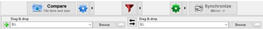
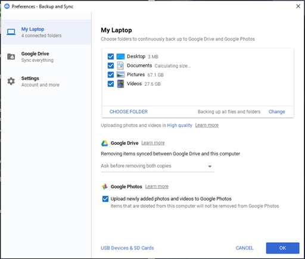
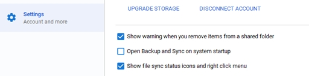

Imagine that: someday you wake up and you can't access your personal files, because someone encrypted them and wants some money in return. Yeah, this and other kind of things can really happen. So, I don't really have to say why backup it's so important, do I? You probably know that.

## The 3-2-1 backup method

The 3-2-1 backup method consists having 3 copies of your data, 2 will be locally on different types of storage, and 1 will be offsite. I think this method perfect to backup personal data, because, as we'll see here, it's really simple and takes no longer than 10 minutes to setup.

## The backup scenario

Imagine you have the following folder structure in your computer or laptop you want to backup:

- Desktop
- Documents
- Pictures
- Videos

In this example we'll be using an external HD and a Google account, so make sure you have these two things before you start.

### The local backup

First of all, you'll need and external HD. Second, install [FreeFileSync](https://freefilesync.org/), it does all the job and it's free. It's a folder comparison and synchronization software. It will mirror all the changes you made locally to the external HD. If you modified or deleted a file, FreeFileSync will know , so you don't have to worry about that.

Now, start FreeFileSync and you'll see something like this:

  

To understand this picture:

- The *D:\ partition* is where **only** the folder structure you want to backup is located (desktop, documents, pictures and videos), and nothing else;
- The *E:\ partition* is the external HD, where you want to backup the folder structure;

- The *Compare* button shows the files who will be deleted, updated, or created in *E:\.*
- The *Synchronize* button starts to backup your files. Make sure you have the *Mirror* option selected, like the image above. If it's not selected, click on the black arrow located on the left side of the Synchronize button, select *Mirror* and you're good to go;

If you have folders, for example, you don't want to backup in the D:\ partition , you'll have to select each folder.  To do that, click on the green add icon that is being shown on the image above, on the left side of the D:\ partition.

The partitions D:\ and E:\ are Windows 10 mounted partitions I'm using as an example. If you use Mac or a Linux Distro, of course it will be very different.

That's it, it will start to backup your files to the external HD. When you're backing up your data, you can see FreeFileSync gives you the option to turn off your computer. It's a good option if you don't want to worry about turning off your computer manually after the backup. I really like that option.

### The cloud backup

Yes, Google offers that option for free. All you have to do is download [Backup and Sync](https://www.google.com/drive/download/backup-and-sync/), and after finish adding your account, go to *preferences*, and set up Backup and Sync as below:

  

1. Choose and add the folders you want to backup;
2. Select to upload photos and video in high quality, so it won't consume your Google Drive storage
3. Check to upload photos and videos to Google Photos.
4. The software will start to check and backup your data. You can see your cloud backup on [Google Drive](http://drive.google.com), there is a menu option for that.

All done. You did and setup the 3-2-1 backup of your personal data.

When you install Google backup and sync, it opens on system startup. I don't like that because it really slows my computer. If you want to disable it too, just uncheck the option like the image below:

  

